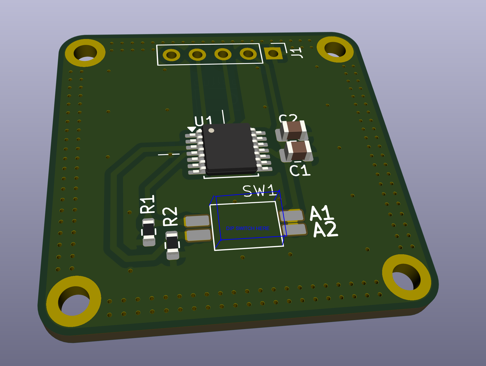

# AS5048B Breakout Board

> [!NOTE]
> This is a breakout for the AS5048B not AS5048A board i.e. this is a breakout for the I²C version.

## Specs & Features 
- 14bit resolution -> 16384 positions per revolution
- I²C High Speed at 3.4MHz clock frequency
- easy hand-assembly

## Usage
### Choosing the correct magnet
* 6-8mm diameter
* >= 2.5mm height
* diametric

### Magnet Placement
* 0.5mm to 2.5mm above IC
* magnet and board share same center (displacement of up to 0.25mm ok)

more details [here](https://look.ams-osram.com/m/287d7ad97d1ca22e/original/AS5048-DS000298.pdf)
